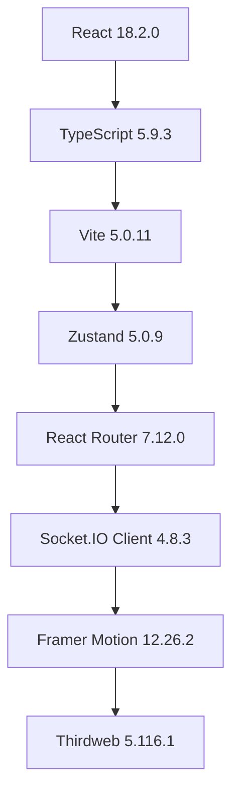
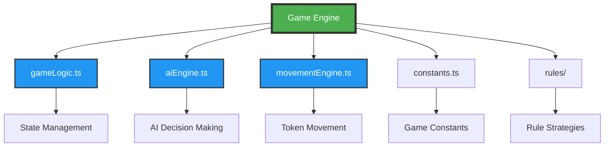
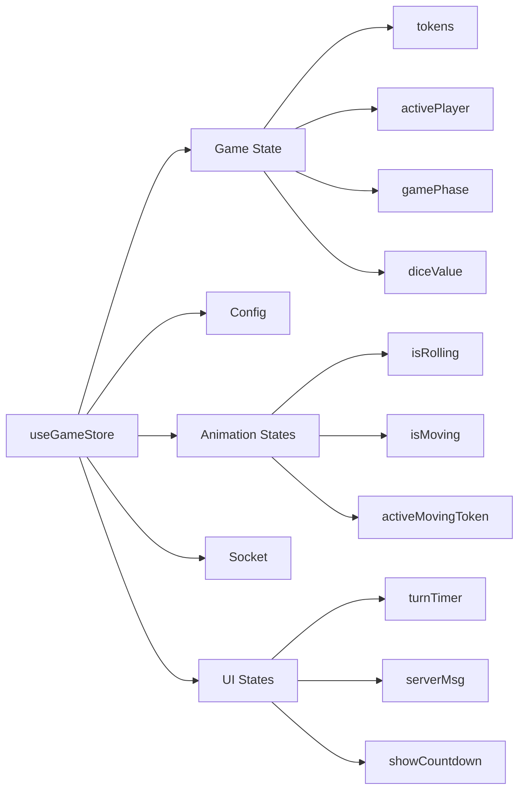
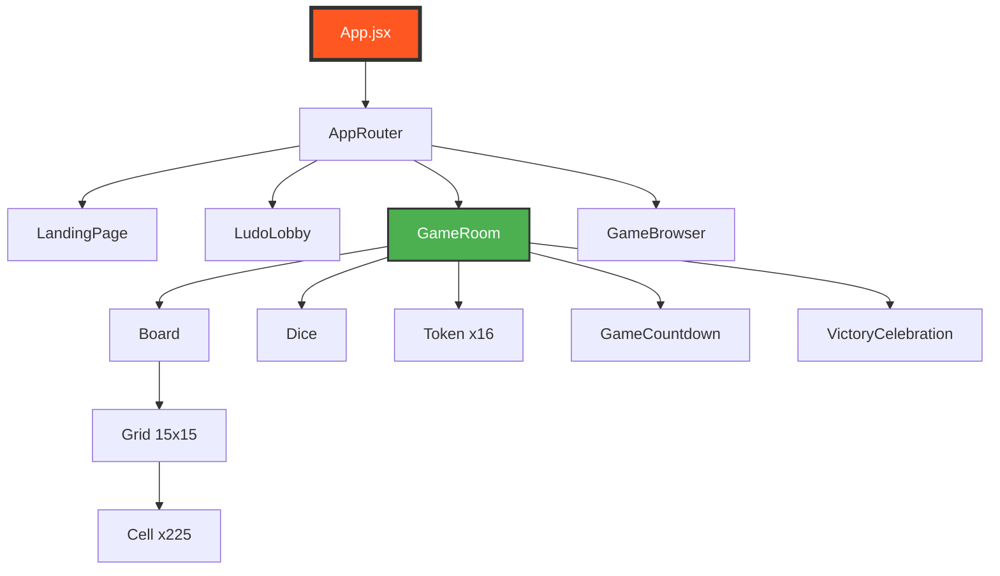
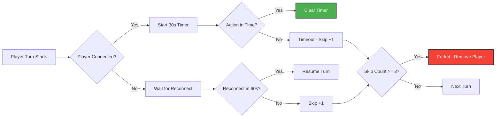

# 🎲 GoLudo - Technisches Audit & Architektur-Übersicht

> **Erstellt am:** 8. Februar 2026  
> **Version:** 1.0.0  
> **Zweck:** Vollständige technische Dokumentation als Grundlage für UI-Verbesserungen

---

## 📋 Inhaltsverzeichnis

1. [Executive Summary](#executive-summary)
2. [Technologie-Stack](#technologie-stack)
3. [Projektstruktur](#projektstruktur)
4. [Core Engine Architektur](#core-engine-architektur)
5. [Frontend Architektur](#frontend-architektur)
6. [Backend Architektur](#backend-architektur)
7. [Smart Contracts](#smart-contracts)
8. [Dateiorganisation](#dateiorganisation)
9. [Empfehlungen für UI-Enhancement](#empfehlungen-für-ui-enhancement)

---

## 🎯 Executive Summary

**GoLudo** ist ein modernes, webbasiertes Ludo-Spiel mit AAA-Qualität, das klassisches Gameplay mit Web3-Integration kombiniert. Das Projekt ist in drei Hauptbereiche unterteilt:

- **Frontend** (React + TypeScript): Benutzeroberfläche und Spielvisualisierung
- **Backend** (Node.js + Socket.IO): Echtzeit-Multiplayer-Server
- **Smart Contracts** (Solidity): Blockchain-basierte Spiellogik auf Flare Network

### Kernmerkmale
- ✅ Mobile-First Design
- ✅ Echtzeit-Multiplayer mit Socket.IO
- ✅ Web3-Integration (Krypto-Stakes)
- ✅ Intelligente KI-Gegner
- ✅ TypeScript für Type-Safety
- ✅ Zustand State Management

---

## 🛠️ Technologie-Stack

### Frontend Stack



| Technologie | Version | Zweck |
|-------------|---------|-------|
| **React** | 18.2.0 | UI Framework - Komponenten-basierte Benutzeroberfläche |
| **TypeScript** | 5.9.3 | Type-Safety - Verhindert Fehler zur Entwicklungszeit |
| **Vite** | 5.0.11 | Build Tool - Schnelle Entwicklung und Builds |
| **Zustand** | 5.0.9 | State Management - Zentrale Spielzustandsverwaltung |
| **React Router** | 7.12.0 | Navigation - Seitenrouting (Lobby, Game, etc.) |
| **Socket.IO Client** | 4.8.3 | WebSocket - Echtzeit-Kommunikation mit Server |
| **Framer Motion** | 12.26.2 | Animationen - Flüssige UI-Animationen |
| **Thirdweb** | 5.116.1 | Web3 - Wallet-Integration und Blockchain-Interaktion |
| **Ethers.js** | 6.16.0 | Web3 - Smart Contract Kommunikation |

### Backend Stack

| Technologie | Version | Zweck |
|-------------|---------|-------|
| **Node.js** | ≥20.0.0 | Runtime - JavaScript-Server |
| **Express** | 5.2.1 | Web Server - REST API Endpoints |
| **Socket.IO** | 4.8.3 | WebSocket Server - Echtzeit-Spiellogik |
| **TypeScript** | 5.9.3 | Type-Safety für Backend |
| **Helmet** | 8.1.0 | Security - HTTP Header Protection |
| **CORS** | 2.8.5 | Security - Cross-Origin Resource Sharing |
| **Rate Limit** | 8.2.1 | Security - DDoS Protection |
| **Zod** | 4.3.6 | Validation - Input Schema Validation |

### Blockchain Stack

| Technologie | Version | Zweck |
|-------------|---------|-------|
| **Solidity** | - | Smart Contract Sprache |
| **Hardhat** | 3.1.3 | Development Environment |
| **OpenZeppelin** | 5.4.0 | Sichere Contract Libraries |
| **Flare Network** | - | Blockchain Platform |

### Development Tools

| Tool | Version | Zweck |
|------|---------|-------|
| **Vitest** | 4.0.16 | Unit Testing Framework |
| **Jest** | - | Backend Testing |
| **TSX** | 4.21.0 | TypeScript Execution |
| **Concurrently** | 9.2.1 | Parallel Script Execution |

---

## 📁 Projektstruktur

### Übersicht

```
GoLudo/
├── 📂 src/                    # Frontend Quellcode
│   ├── 📂 engine/            # Spiellogik (headless)
│   ├── 📂 components/        # UI Komponenten
│   ├── 📂 pages/             # Seiten (Routing)
│   ├── 📂 store/             # Zustand State Management
│   ├── 📂 hooks/             # Custom React Hooks
│   ├── 📂 services/          # External Services (API, Socket)
│   ├── 📂 types/             # TypeScript Definitionen
│   ├── 📂 config/            # App Konfiguration
│   └── 📂 abi/               # Smart Contract ABIs
│
├── 📂 backend/               # Multiplayer Server
│   ├── server.ts             # Haupt-Server (Socket.IO + Express)
│   ├── contractVerifier.js  # Blockchain Verification
│   ├── signer.js             # Payout Signing
│   ├── roomManager.js        # Room Lifecycle Management
│   ├── validation.js         # Input Validation (Zod)
│   └── 📂 __tests__/         # Backend Tests
│
├── 📂 smart-contracts/       # Blockchain Contracts
│   ├── 📂 contracts/         # Solidity Files
│   ├── 📂 scripts/           # Deployment Scripts
│   └── 📂 test/              # Contract Tests
│
├── 📂 docs/                  # Dokumentation
├── 📂 public/                # Statische Assets
├── 📂 dist/                  # Production Build
└── 📄 package.json           # Dependencies
```

### Detaillierte Struktur

#### Frontend (`src/`)

```
src/
├── engine/                   # 🎮 CORE ENGINE (Headless Game Logic)
│   ├── gameLogic.ts         # Hauptspiellogik (Würfeln, Bewegen, Gewinnbedingungen)
│   ├── aiEngine.ts          # KI-Entscheidungslogik (Priority-based)
│   ├── movementEngine.ts    # Token-Bewegungsberechnung
│   ├── boardMap.ts          # Spielbrett-Koordinaten
│   ├── constants.ts         # Spielkonstanten (Regeln, Positionen)
│   ├── rules/               # Spielmodus-Regeln
│   │   ├── classicRules.ts  # Klassischer Modus
│   │   ├── fastRules.ts     # Schneller Modus
│   │   └── index.ts         # Rules Factory
│   └── __tests__/           # Engine Tests
│
├── components/              # 🎨 UI KOMPONENTEN
│   ├── Board.jsx            # Spielbrett (15x15 Grid)
│   ├── Token.jsx            # Spielsteine mit Animationen
│   ├── Dice.jsx             # 3D Würfel mit Roll-Animation
│   ├── Lobby.jsx            # Lobby für Spielerstellung
│   ├── AAACountdown.tsx     # Pre-Game Countdown
│   ├── GameCountdown.tsx    # Turn Timer Countdown
│   ├── VictoryCelebration.jsx  # Gewinn-Animation
│   ├── CaptureExplosion.jsx    # Capture-Effekt
│   ├── ParticleEffects.jsx     # Partikel-System
│   ├── WarpTransition.tsx      # Seitenwechsel-Animation
│   └── layout/
│       └── GlobalHeader.tsx    # App Header
│
├── pages/                   # 📄 SEITEN (React Router)
│   ├── LandingPage.tsx      # Startseite
│   ├── LudoLobby.tsx        # Lobby-Seite
│   ├── GameRoom.tsx         # Spielraum
│   └── GameBrowser.tsx      # Raum-Browser
│
├── store/                   # 🗄️ STATE MANAGEMENT (Zustand)
│   ├── useGameStore.ts      # Haupt-Game-State
│   └── useLobbyStore.ts     # Lobby-State
│
├── hooks/                   # 🪝 CUSTOM HOOKS
│   ├── useGameAI.ts         # KI-Integration
│   └── useGameSocket.ts     # Socket.IO Integration
│
├── services/                # 🔌 EXTERNAL SERVICES
│   └── SoundManager.ts      # Audio Management
│
├── types/                   # 📝 TYPESCRIPT TYPES
│   └── index.ts             # Zentrale Type Definitions
│
├── config/                  # ⚙️ KONFIGURATION
│   ├── api.ts               # API Endpoints
│   ├── routes.ts            # Route Definitionen
│   └── web3.ts              # Web3 Config
│
├── abi/                     # 📜 SMART CONTRACT ABIs
│   ├── LudoVault.json       # Vault Contract ABI
│   └── GoToken.json         # Token Contract ABI
│
├── App.jsx                  # Haupt-App-Komponente
├── AppRouter.tsx            # Router-Konfiguration
├── main.tsx                 # Entry Point
├── index.css                # Globale Styles
└── App.css                  # App-spezifische Styles
```

#### Backend (`backend/`)

```
backend/
├── server.ts                # 🎮 HAUPT-SERVER
│   ├── Express Server       # REST API
│   ├── Socket.IO Server     # WebSocket für Echtzeit
│   ├── Game State Manager   # Spielzustand-Verwaltung
│   ├── Turn Timer System    # AFK/Timeout Management
│   └── Security Middleware  # Helmet, CORS, Rate Limiting
│
├── contractVerifier.js      # 🔐 BLOCKCHAIN VERIFICATION
│   ├── Room Creation Verify # On-Chain Verification
│   ├── Room Join Verify     # Transaction Validation
│   └── Blockchain Recovery  # Server Restart Recovery
│
├── signer.js                # ✍️ PAYOUT SIGNING
│   └── Cryptographic Signing # Server-signed Payouts
│
├── roomManager.js           # 🏠 ROOM LIFECYCLE
│   ├── Timer Management     # Cleanup Timers
│   └── Memory Leak Prevention
│
├── validation.js            # ✅ INPUT VALIDATION (Zod)
│   ├── Create Room Schema
│   ├── Join Room Schema
│   └── Payout Schema
│
└── __tests__/               # 🧪 TESTS
    ├── stress.test.js       # Load Testing
    ├── connection.test.js   # Socket Tests
    └── gameLogic.test.js    # Logic Tests
```

#### Smart Contracts (`smart-contracts/`)

```
smart-contracts/
├── contracts/
│   └── LudoVault.sol        # Haupt-Contract (Stakes, Payouts)
│
├── scripts/
│   └── deploy.js            # Deployment Script
│
├── test/
│   └── LudoVault.test.js    # Contract Tests
│
└── hardhat.config.js        # Hardhat Konfiguration
```

---

## 🎮 Core Engine Architektur

### Engine-Übersicht

Die **Game Engine** ist vollständig **headless** (UI-unabhängig) und kann sowohl im Frontend als auch im Backend verwendet werden.



### 1. Game Logic (`gameLogic.ts`)

**Zweck:** Zentrale Spiellogik nach USA Standard Ludo Regeln

**Hauptfunktionen:**

| Funktion | Beschreibung |
|----------|--------------|
| `createInitialState()` | Erstellt initialen Spielzustand (4 Spieler, Tokens in Yard) |
| `rollDice()` | Würfelt und berechnet gültige Züge |
| `moveToken()` | Bewegt Token und behandelt Captures |
| `completeMoveAnimation()` | Post-Move Processing (Bonus, Gewinn-Check) |
| `checkWinner()` | Prüft Gewinnbedingung (alle Tokens im Ziel) |

**Spielregeln (USA Standard):**
- 🎲 **Entry Roll:** 6 erforderlich zum Starten
- ⭐ **Bonus on Six:** Nochmal würfeln bei 6
- ⚠️ **Triple Six Penalty:** Zug verloren bei 3x 6 hintereinander
- 🎯 **Capture Bonus:** +20 Bewegungspunkte bei Capture
- 🏠 **Home Bonus:** +10 Bewegungspunkte bei Ziel-Einlauf
- 🔒 **Blockade:** 2 eigene Tokens blockieren Gegner (optional)
- ✅ **Safe Zones:** Start-Positionen + Star-Positionen (8 Felder nach Start)

**Spielphasen:**
```typescript
GAME_PHASE = {
    ROLL_DICE,      // Spieler muss würfeln
    SELECT_TOKEN,   // Spieler muss Token wählen
    BONUS_MOVE,     // Bonus-Zug (nach Capture/Home)
    MOVING,         // Animation läuft
    WIN             // Spiel beendet
}
```

### 2. AI Engine (`aiEngine.ts`)

**Zweck:** Intelligente KI-Gegner mit Priority-based Decision Making

**Scoring-System:**

| Priorität | Aktion | Score | Erklärung |
|-----------|--------|-------|-----------|
| 1 | Capture Enemy | 100+ | Gegner schlagen (höchste Priorität) |
| 2 | Reach Home | 80 | Token ins Ziel bringen |
| 3 | Enter Safe Zone | 40 | Sicheren Bereich betreten |
| 4 | Escape Danger | 30 | Gefahr entkommen |
| 5 | Enter Home Stretch | 35 | Zielgerade betreten |
| 6 | Spawn Token | 25-50 | Neues Token starten |
| 7 | Advance Position | 1-5 | Vorwärts bewegen |
| - | Move to Danger | -15 | Strafe für gefährliche Züge |

**KI-Logik:**
```typescript
function calculateAIMove(gameState) {
    // 1. Alle gültigen Züge bewerten
    // 2. Nach Score sortieren
    // 3. Top 2 Züge mit leichter Randomness (30% Chance)
    // 4. Besten Zug zurückgeben
}
```

### 3. Movement Engine (`movementEngine.ts`)

**Zweck:** Berechnet Token-Bewegungen und Captures

**Hauptfunktionen:**
- `calculateMove()`: Berechnet Zielposition basierend auf Würfelwert
- `isBlockedByBlockade()`: Prüft Blockaden
- `detectCaptures()`: Findet Captures auf Zielposition

**Spielbrett-Layout:**
- 15x15 Grid
- 52 Hauptweg-Positionen (Master Loop)
- 4x 6 Home Stretch Positionen (100-105 pro Spieler)
- 4x 4 Yard Positionen (Startbereich)

### 4. Constants (`constants.ts`)

**Zweck:** Zentrale Spielkonstanten

**Wichtige Konstanten:**
```typescript
GRID_SIZE = 15
MAIN_PATH_LENGTH = 52
HOME_STRETCH_START = 100
HOME_STRETCH_LENGTH = 6
TOKENS_PER_PLAYER = 4

POSITION = {
    IN_YARD: -1,      // Token im Startbereich
    FINISHED: 999     // Token im Ziel
}

SAFE_POSITIONS = [
    0, 13, 26, 39,    // Start-Positionen
    8, 21, 34, 47     // Star-Positionen
]
```

### 5. Rules System (`rules/`)

**Zweck:** Strategy Pattern für verschiedene Spielmodi

**Verfügbare Modi:**
- **Classic Rules:** Standard Ludo (4 Tokens, alle Regeln)
- **Fast Rules:** Schnelles Spiel (2 Tokens, vereinfachte Regeln)

**Zukünftige Modi (Roadmap):**
- Team Play (2v2)
- Blitz (5-Minuten-Matches)
- Tournament (Ranked)

---

## 🎨 Frontend Architektur

### State Management (Zustand)

**Warum Zustand?**
- ✅ Einfacher als Redux
- ✅ Keine Boilerplate
- ✅ Optimierte Re-Renders durch Selectors
- ✅ Transient Updates für Animationen

**Store-Struktur:**



**Haupt-State (`useGameStore.ts`):**

| State | Typ | Zweck |
|-------|-----|-------|
| `appState` | 'lobby' \| 'game' | Aktuelle App-Ansicht |
| `config` | GameConfig | Spielkonfiguration (Modus, Spieler) |
| `state` | GameState | Aktueller Spielzustand (von Engine) |
| `isRolling` | boolean | Würfel-Animation läuft |
| `isMoving` | boolean | Token-Animation läuft |
| `activeMovingToken` | Object | Aktuell animierendes Token |
| `boardRotation` | number | Board-Rotation (für lokalen Spieler) |
| `turnTimer` | number | Verbleibende Zeit (Sekunden) |
| `socket` | Socket | Socket.IO Instanz |
| `myPlayerIndex` | number | Lokaler Spieler-Index (Multiplayer) |
| `payoutProof` | Object | Payout-Signatur (Web3) |

**Selectors (Performance-Optimierung):**
```typescript
// Nur re-render wenn activePlayer sich ändert
const activePlayer = useGameStore(selectActivePlayer);

// Mehrere Werte mit useShallow
const { isRolling, isMoving } = useGameStore(
    useShallow((s) => ({ isRolling: s.isRolling, isMoving: s.isMoving }))
);
```

### Component Hierarchy



**Komponenten-Übersicht:**

| Komponente | Datei | Zweck |
|------------|-------|-------|
| **App** | App.jsx | Root-Komponente, Socket-Integration |
| **AppRouter** | AppRouter.tsx | React Router Konfiguration |
| **LandingPage** | LandingPage.tsx | Startseite (Local/AI/Web3 Auswahl) |
| **LudoLobby** | LudoLobby.tsx | Lobby für Spielerstellung |
| **GameRoom** | GameRoom.tsx | Haupt-Spielansicht |
| **Board** | Board.jsx | 15x15 Spielbrett-Grid |
| **Token** | Token.jsx | Spielstein mit Animationen |
| **Dice** | Dice.jsx | 3D Würfel mit Roll-Animation |
| **AAACountdown** | AAACountdown.tsx | Pre-Game Countdown (5-4-3-2-1) |
| **GameCountdown** | GameCountdown.tsx | Turn Timer (30s) |
| **VictoryCelebration** | VictoryCelebration.jsx | Gewinn-Feuerwerk |
| **CaptureExplosion** | CaptureExplosion.jsx | Capture-Effekt |
| **ParticleEffects** | ParticleEffects.jsx | Partikel-System |
| **GlobalHeader** | GlobalHeader.tsx | App-Header mit Navigation |

### Routing

**Routes (`config/routes.ts`):**
```typescript
ROUTES = {
    HOME: '/',
    LOBBY: '/lobby',
    GAME: (roomId) => `/game/${roomId}`,
    BROWSE: '/browse'
}
```

**Navigation Flow:**
```
LandingPage → LudoLobby → GameRoom
     ↓            ↓           ↓
  (Auswahl)   (Setup)    (Spielen)
```

### Animation System

**Framer Motion Integration:**
- Dice Roll: 3D Rotation mit Physics
- Token Movement: Smooth Path Animation
- Capture: Explosion Effect
- Victory: Confetti + Fireworks
- Page Transitions: Warp Effect

**Performance:**
- Transient Updates (keine Parent Re-Renders)
- CSS Transforms (GPU-beschleunigt)
- RequestAnimationFrame für Smooth Animations

---

## 🔌 Backend Architektur

### Server-Übersicht

```mermaid
graph TB
    A[server.ts] --> B[Express Server]
    A --> C[Socket.IO Server]
    A --> D[Security Middleware]
    
    B --> E[REST Endpoints]
    C --> F[WebSocket Events]
    D --> G[Helmet]
    D --> H[CORS]
    D --> I[Rate Limiting]
    
    E --> E1[/health]
    E --> E2[/metrics]
    E --> E3[/api/payout/sign]
    
    F --> F1[join_match]
    F --> F2[roll_dice]
    F --> F3[move_token]
    F --> F4[disconnect]
    
    style A fill:#FF9800,stroke:#333,stroke-width:4px,color:#fff
    style B fill:#2196F3,stroke:#333,stroke-width:2px,color:#fff
    style C fill:#4CAF50,stroke:#333,stroke-width:2px,color:#fff
```

### REST API Endpoints

| Endpoint | Method | Zweck | Rate Limit |
|----------|--------|-------|------------|
| `/health` | GET | Health Check (Railway/Docker) | - |
| `/metrics` | GET | Server Metrics (Monitoring) | - |
| `/api/payout/sign` | POST | Payout Signatur erstellen | 10/min |

**Health Check Response:**
```json
{
    "status": "ok",
    "uptime": 12345,
    "activeRooms": 5,
    "memory": {
        "heapUsed": "45MB",
        "heapTotal": "60MB",
        "rss": "80MB"
    },
    "timestamp": "2026-02-08T13:47:31Z"
}
```

### Socket.IO Events

**Client → Server:**

| Event | Payload | Zweck |
|-------|---------|-------|
| `join_match` | `{ roomId, playerAddress }` | Socket mit Spieler verknüpfen |
| `roll_dice` | `{ roomId, playerAddress }` | Würfeln |
| `move_token` | `{ roomId, playerAddress, tokenIndex }` | Token bewegen |

**Server → Client:**

| Event | Payload | Zweck |
|-------|---------|-------|
| `pre_game_countdown` | `{ room, countdownSeconds, message }` | Countdown vor Spielstart |
| `countdown_tick` | `{ remaining, connectedPlayers, totalPlayers }` | Countdown Update |
| `game_started` | `room` | Spiel gestartet |
| `state_update` | `gameState` | Spielzustand-Update |
| `dice_rolled` | `{ value, playerIndex }` | Würfel-Ergebnis |
| `turn_timer_start` | `{ playerIndex, expiresAt, phase }` | Turn Timer gestartet |
| `turn_timeout` | `{ playerIndex, playerName, phase }` | Turn Timeout |
| `player_skipped` | `{ playerIndex, playerName, skipCount, maxSkips, reason }` | Spieler übersprungen |
| `game_error` | `{ message }` | Fehler |

### Turn Timer System

**AAA-Level Timeout Management:**



**Timeouts:**
- **Turn Timeout:** 30 Sekunden (AFK während Zug)
- **Reconnect Window:** 60 Sekunden (nach Disconnect)
- **Max Skips:** 3 (danach Forfeit)

**Skip-Gründe:**
- `afk_timeout`: Spieler hat nicht in 30s gehandelt
- `disconnect`: Spieler hat nicht in 60s reconnected

### Room Lifecycle

**Room Status:**
```
WAITING → STARTING → ACTIVE → WIN
   ↓         ↓         ↓       ↓
(Warten) (Countdown) (Spiel) (Ende)
```

**Cleanup:**
- Automatische Cleanup-Jobs alle 5 Minuten
- Room-Removal 5 Minuten nach Spielende
- Timer-Cleanup bei Disconnect/Forfeit

### Security Features

**1. Helmet.js (HTTP Headers):**
```javascript
helmet({
    contentSecurityPolicy: false,
    crossOriginEmbedderPolicy: false
})
```

**2. CORS (Cross-Origin):**
```javascript
ALLOWED_ORIGINS = [
    "https://goludo.netlify.app",
    "https://goludo-production.up.railway.app"
]
```

**3. Rate Limiting:**
- Payout: 10 requests/min
- Room Creation: 5 requests/min
- Room Join: 10 requests/min

**4. Input Validation (Zod):**
```javascript
createRoomSchema = z.object({
    roomId: z.string().min(1),
    stake: z.string(),
    maxPlayers: z.number().min(2).max(4),
    // ...
})
```

**5. Blockchain Verification:**
- Room Creation: On-Chain Transaction Verification
- Room Join: Transaction Validation
- Payout: Server-signed Cryptographic Proof

### Blockchain Recovery

**Server Restart Recovery:**
```javascript
recoverActiveRoomsFromBlockchain()
    → Scannt Flare Blockchain
    → Findet aktive Rooms
    → Stellt Server-State wieder her
```

---

## 🔗 Smart Contracts

### Contract-Übersicht

**LudoVault.sol** - Haupt-Contract

**Funktionen:**

| Funktion | Zweck |
|----------|-------|
| `createRoom()` | Erstellt neuen Raum mit Stake |
| `joinRoom()` | Tritt Raum bei (zahlt Stake) |
| `claimPayout()` | Gewinner claimed Pot |
| `getRoomState()` | Liest Raum-Status |

**Events:**
```solidity
event RoomCreated(bytes32 roomId, address creator, uint256 stake);
event PlayerJoined(bytes32 roomId, address player);
event PayoutClaimed(bytes32 roomId, address winner, uint256 amount);
```

**Deployment:**
- Network: Flare Coston2 (Testnet)
- Hardhat für Deployment
- Ethers.js für Interaktion

---

## 📊 Dateiorganisation

### Wichtige Dateien

**Root-Level:**

| Datei | Zweck |
|-------|-------|
| [package.json](file:///C:/Users/blexx/Desktop/Code/GoLudo/package.json) | Dependencies und Scripts |
| [tsconfig.json](file:///C:/Users/blexx/Desktop/Code/GoLudo/tsconfig.json) | TypeScript Konfiguration |
| [vite.config.ts](file:///C:/Users/blexx/Desktop/Code/GoLudo/vite.config.ts) | Vite Build Konfiguration |
| [index.html](file:///C:/Users/blexx/Desktop/Code/GoLudo/index.html) | HTML Entry Point |
| `.env` | Environment Variables |
| [netlify.toml](file:///C:/Users/blexx/Desktop/Code/GoLudo/netlify.toml) | Netlify Deployment Config |
| [railway.json](file:///C:/Users/blexx/Desktop/Code/GoLudo/railway.json) | Railway Backend Config |

**Configuration Files:**

```typescript
// vite.config.ts
export default defineConfig({
    plugins: [react()],
    test: {
        environment: 'jsdom',
        globals: true
    }
})

// tsconfig.json
{
    "compilerOptions": {
        "target": "ES2020",
        "lib": ["ES2020", "DOM"],
        "module": "ESNext",
        "moduleResolution": "bundler",
        "strict": true
    }
}
```

### CSS-Architektur

**Styling-Ansatz:**
- Vanilla CSS (kein Tailwind)
- Component-scoped CSS Files
- CSS Variables für Theming
- Mobile-First Design

**Wichtige CSS-Dateien:**

| Datei | Zweck |
|-------|-------|
| [index.css](file:///C:/Users/blexx/Desktop/Code/GoLudo/src/index.css) | Globale Styles, CSS Variables |
| [App.css](file:///C:/Users/blexx/Desktop/Code/GoLudo/src/App.css) | App-Container Styles |
| [Board.css](file:///C:/Users/blexx/Desktop/Code/GoLudo/src/components/Board.css) | Spielbrett-Grid Styles |
| [Token.css](file:///C:/Users/blexx/Desktop/Code/GoLudo/src/components/Token.css) | Token-Animationen |
| [Dice.css](file:///C:/Users/blexx/Desktop/Code/GoLudo/src/components/Dice.css) | 3D Würfel Styles |
| [Lobby.css](file:///C:/Users/blexx/Desktop/Code/GoLudo/src/components/Lobby.css) | Lobby UI Styles |

**CSS Variables (Design Tokens):**
```css
:root {
    --color-red: #e74c3c;
    --color-green: #2ecc71;
    --color-yellow: #f39c12;
    --color-blue: #3498db;
    
    --board-size: min(90vw, 90vh);
    --cell-size: calc(var(--board-size) / 15);
    
    --animation-duration: 0.3s;
    --animation-easing: cubic-bezier(0.4, 0, 0.2, 1);
}
```

---

## 🎨 Empfehlungen für UI-Enhancement

### 1. Design System

**Aktueller Stand:**
- ✅ CSS Variables vorhanden
- ✅ Component-scoped Styles
- ❌ Kein zentrales Design System

**Empfehlung:**
```
src/design-system/
├── tokens.css          # Design Tokens (Colors, Spacing, Typography)
├── components/         # Reusable UI Components
│   ├── Button.tsx
│   ├── Card.tsx
│   └── Modal.tsx
└── animations.css      # Shared Animations
```

### 2. Component-Struktur

**Aktuell:**
- Alle Komponenten in `src/components/` (flach)

**Empfehlung:**
```
src/components/
├── game/               # Game-specific
│   ├── Board/
│   ├── Token/
│   └── Dice/
├── lobby/              # Lobby-specific
│   └── PlayerSetup/
├── common/             # Shared
│   ├── Button/
│   ├── Card/
│   └── Modal/
└── layout/             # Layout
    ├── Header/
    └── Footer/
```

### 3. Responsive Design

**Aktuell:**
- Mobile-First vorhanden
- Board skaliert mit `min(90vw, 90vh)`

**Verbesserungen:**
- Breakpoints definieren
- Tablet-optimierte Layouts
- Desktop-spezifische Features

**Empfohlene Breakpoints:**
```css
/* Mobile First */
@media (min-width: 640px) { /* Tablet */ }
@media (min-width: 1024px) { /* Desktop */ }
@media (min-width: 1280px) { /* Large Desktop */ }
```

### 4. Animation-Performance

**Aktuell:**
- Framer Motion für Animationen
- Transient Updates in Zustand

**Optimierungen:**
- `will-change` für animierte Elemente
- `transform` statt `top/left`
- `requestAnimationFrame` für Custom Animations

```css
.token {
    will-change: transform;
    transform: translate3d(0, 0, 0); /* GPU-Beschleunigung */
}
```

### 5. Accessibility (A11y)

**Fehlende Features:**
- ❌ Keyboard Navigation
- ❌ Screen Reader Support
- ❌ ARIA Labels
- ❌ Focus Management

**Empfehlungen:**
```tsx
// Keyboard Support
<button
    onClick={handleRoll}
    onKeyDown={(e) => e.key === 'Enter' && handleRoll()}
    aria-label="Roll Dice"
    tabIndex={0}
>
    Roll
</button>

// Screen Reader
<div role="status" aria-live="polite">
    {gameState.message}
</div>
```

### 6. Dark Mode

**Aktuell:**
- Nur Light Mode

**Empfehlung:**
```css
@media (prefers-color-scheme: dark) {
    :root {
        --bg-color: #1a1a1a;
        --text-color: #ffffff;
        --board-bg: #2d2d2d;
    }
}
```

### 7. Performance-Optimierungen

**Aktuelle Performance:**
- ✅ Code Splitting (React Router)
- ✅ Lazy Loading (Components)
- ❌ Image Optimization
- ❌ Bundle Size Optimization

**Empfehlungen:**
```typescript
// Lazy Loading
const GameRoom = lazy(() => import('./pages/GameRoom'));

// Image Optimization
import { defineConfig } from 'vite';
import imagemin from 'vite-plugin-imagemin';

export default defineConfig({
    plugins: [
        imagemin({
            gifsicle: { optimizationLevel: 7 },
            optipng: { optimizationLevel: 7 },
            mozjpeg: { quality: 80 },
            svgo: { plugins: [{ removeViewBox: false }] }
        })
    ]
});
```

### 8. Testing

**Aktueller Stand:**
- ✅ Vitest Setup
- ✅ Engine Tests
- ✅ Backend Tests
- ❌ Component Tests
- ❌ E2E Tests

**Empfehlungen:**
```typescript
// Component Test (Vitest + Testing Library)
import { render, screen } from '@testing-library/react';
import { Dice } from './Dice';

test('renders dice with correct value', () => {
    render(<Dice value={6} />);
    expect(screen.getByText('6')).toBeInTheDocument();
});

// E2E Test (Playwright)
test('can roll dice and move token', async ({ page }) => {
    await page.goto('/game/test-room');
    await page.click('[data-testid="roll-button"]');
    await expect(page.locator('.dice')).toHaveClass(/rolling/);
});
```

### 9. Error Handling

**Aktuell:**
- Socket Error Events
- Try-Catch in Backend

**Verbesserungen:**
```tsx
// Error Boundary
class ErrorBoundary extends React.Component {
    componentDidCatch(error, errorInfo) {
        logErrorToService(error, errorInfo);
    }
    
    render() {
        if (this.state.hasError) {
            return <ErrorFallback />;
        }
        return this.props.children;
    }
}

// Toast Notifications
import { toast } from 'react-hot-toast';

socket.on('game_error', ({ message }) => {
    toast.error(message);
});
```

### 10. Internationalization (i18n)

**Aktuell:**
- Nur Englisch

**Empfehlung:**
```typescript
// i18n Setup (react-i18next)
import i18n from 'i18next';
import { initReactI18next } from 'react-i18next';

i18n.use(initReactI18next).init({
    resources: {
        en: { translation: { "roll_dice": "Roll Dice" } },
        de: { translation: { "roll_dice": "Würfeln" } }
    },
    lng: 'en',
    fallbackLng: 'en'
});

// Usage
import { useTranslation } from 'react-i18next';

function Dice() {
    const { t } = useTranslation();
    return <button>{t('roll_dice')}</button>;
}
```

---

## 📈 Nächste Schritte

### Kurzfristig (1-2 Wochen)

1. **Design System erstellen**
   - CSS Variables standardisieren
   - Reusable Components (Button, Card, Modal)
   - Typography System

2. **Component-Struktur verbessern**
   - Ordner-Hierarchie (game/, lobby/, common/)
   - Component-Dokumentation (Storybook?)

3. **Accessibility verbessern**
   - Keyboard Navigation
   - ARIA Labels
   - Screen Reader Support

### Mittelfristig (1 Monat)

4. **Dark Mode implementieren**
   - CSS Variables für Themes
   - Theme Toggle Component

5. **Performance optimieren**
   - Image Optimization
   - Bundle Size reduzieren
   - Lighthouse Score >90

6. **Testing erweitern**
   - Component Tests (Testing Library)
   - E2E Tests (Playwright)
   - Visual Regression Tests

### Langfristig (2-3 Monate)

7. **Internationalization**
   - i18n Setup (react-i18next)
   - Übersetzungen (EN, DE, ES, FR)

8. **Advanced Features**
   - Replay System
   - Game Statistics
   - Leaderboards

9. **Mobile App**
   - React Native Version
   - Native Performance

---

## 📝 Zusammenfassung

### Stärken

✅ **Saubere Architektur:** Headless Engine, klare Trennung Frontend/Backend  
✅ **Type-Safety:** TypeScript durchgehend  
✅ **Modern Stack:** React 18, Vite, Zustand, Socket.IO  
✅ **Web3 Integration:** Flare Network, Smart Contracts  
✅ **Security:** Helmet, CORS, Rate Limiting, Blockchain Verification  
✅ **Testing:** Vitest, Jest, Hardhat Tests  

### Verbesserungspotenzial

🔧 **Design System:** Kein zentrales Design System  
🔧 **Accessibility:** Fehlende A11y Features  
🔧 **Testing:** Keine Component/E2E Tests  
🔧 **i18n:** Nur Englisch  
🔧 **Dark Mode:** Nicht implementiert  

### Technische Schulden

⚠️ **Component-Struktur:** Flache Hierarchie in `src/components/`  
⚠️ **CSS-Organisation:** Keine zentrale Design Token Library  
⚠️ **Error Handling:** Kein Error Boundary  
⚠️ **Performance:** Keine Image Optimization  

---

## 🎯 Fazit

GoLudo ist ein **technisch solides Projekt** mit AAA-Qualität in der Core Engine und Backend-Architektur. Die **Hauptstärke** liegt in der sauberen Trennung von Spiellogik (headless) und UI, sowie der robusten Multiplayer-Infrastruktur.

Für **UI-Enhancements** sollte der Fokus auf:
1. **Design System** (zentrale Design Tokens)
2. **Component-Struktur** (bessere Organisation)
3. **Accessibility** (A11y Features)
4. **Performance** (Optimierungen)

Die **Codebase ist bereit** für größere UI-Refactorings, da die Engine unabhängig von der UI ist und alle State-Management-Patterns bereits etabliert sind.

---

**Erstellt von:** Antigravity AI  
**Datum:** 8. Februar 2026  
**Version:** 1.0.0  
**Kontakt:** Für Fragen zum Audit
